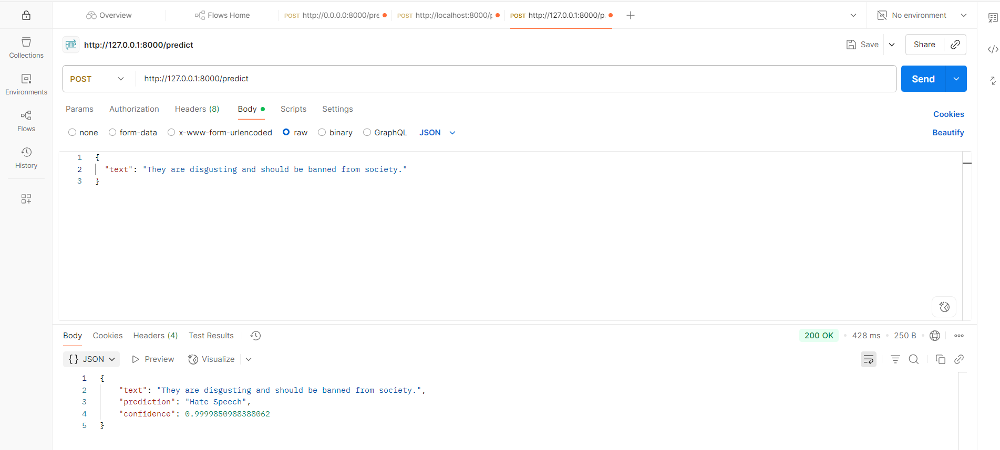

# Hate Speech Detection API 🛡️

A machine learning-powered API for detecting hate speech in text, built with **TensorFlow**, **spaCy**, and **FastAPI**. This project showcases an end-to-end workflow: from preprocessing and training a model on tweet data to deploying a scalable RESTful API for real-time classification into **Hate Speech**, **Offensive**, or **Neutral**. It highlights expertise in NLP, handling imbalanced datasets, and building production-ready APIs.

## 🚀 Why This Project?
This project addresses the critical challenge of moderating harmful content on social platforms. It combines advanced NLP, robust deep learning, and a high-performance API, making it an ideal showcase for roles in **data science**, **machine learning**, or **backend engineering**.

## 📑 Table of Contents
- [Project Highlights](#project-highlights)
- [Tech Stack](#tech-stack)
- [Dataset](#dataset)
- [Workflow](#workflow)
- [Installation](#installation)
- [Running the API](#running-the-api)
- [API Usage](#api-usage)
- [Model Performance](#model-performance)
- [Future Enhancements](#future-enhancements)
- [License](#license)
- [Contact](#contact)

## 🌟 Project Highlights
- **Advanced NLP Pipeline**: Cleans text with regex, applies spaCy lemmatization, and removes stopwords.
- **Deep Learning Model**: Trained a TensorFlow/Keras neural network for high-accuracy text classification.
- **Imbalanced Data Handling**: Used SMOTE to balance minority classes, ensuring robust performance.
- **Custom Inference Logic**: Refines low-confidence predictions (<99.9%) by selecting the better of the top-2 classes.
- **Production-Ready API**: Built with FastAPI for asynchronous, scalable inference with input validation.
- **Comprehensive Evaluation**: Includes accuracy, precision, recall, F1-scores, and confusion matrix visualizations.

## 🛠️ Tech Stack
| Technology        | Version | Purpose                              |
|-------------------|---------|--------------------------------------|
| **Python**        | 3.12    | Core programming language            |
| **TensorFlow/Keras** | 2.x  | Model building and training          |
| **spaCy**         | 3.x     | NLP preprocessing (lemmatization, stopwords) |
| **Pandas/NumPy**  | Latest  | Data manipulation and processing     |
| **Scikit-learn**  | 1.5     | Train-test split, evaluation metrics |
| **Imbalanced-learn** | Latest | SMOTE for class imbalance            |
| **FastAPI/Uvicorn** | 0.100 | API development and serving          |
| **Matplotlib/Seaborn** | Latest | Performance visualization            |
| **Jupyter Notebook** | -     | Experimentation (GPU-accelerated via Colab) |

## 📊 Dataset
- **Source**: `labeled_data.csv` (~24,783 tweets).
- **Labels**: 0 (Hate Speech), 1 (Offensive), 2 (Neutral).
- **Characteristics**: Imbalanced, with more offensive/neutral samples.
- **Preprocessing**:
  - 🧹 Removed non-alphabetic characters using regex.
  - 📝 Lemmatized and removed stopwords with spaCy.
  - 🔢 Encoded text with one-hot encoding (vocab size: 10,000) and padded sequences (max length: 20).

## 🔄 Workflow
### 1. Model Training (`Hate_Speech_Detection.ipynb`)
- **Data Loading**: Imported tweet data with Pandas.
- **Preprocessing**: Cleaned, lemmatized, and encoded text sequences.
- **Balancing**: Applied SMOTE to oversample minority classes.
- **Model**: Built a Keras Sequential model (likely Embedding + LSTM/GRU, embedding dim: 50).
- **Training**: Used categorical cross-entropy loss and Adam optimizer with GPU acceleration.
- **Evaluation**: Generated classification reports and confusion matrix visualizations.
- **Export**: Saved as `hate_speech_model.h5`.

### 2. API Deployment (`app.py`)
- **Model Loading**: Loads the trained `.h5` model.
- **Preprocessing**: Mirrors notebook's cleaning and encoding steps.
- **Prediction Logic**: Returns top class if confidence > 99.9%; else, selects better of top-2 classes.
- **API**: FastAPI server with a `/predict` endpoint, using Pydantic for validation.

## 🖥️ Installation
1. Clone the repository:
   ```bash
   git clone https://github.com/yourusername/hate-speech-detection-api.git
   cd hate-speech-detection-api
   ```
2. Create and activate a virtual environment:
   ```bash
   python -m venv venv
   source venv/bin/activate  # On Windows: venv\Scripts\activate
   ```
3. Install dependencies:
   ```bash
   pip install -r requirements.txt
   ```
   *Tip: Generate `requirements.txt` with `pip freeze > requirements.txt`.*
4. Install spaCy model:
   ```bash
   python -m spacy download en_core_web_sm
   ```
5. Place `hate_speech_model.h5` in the project root.

## 🚀 Running the API
Start the FastAPI server:
```bash
python app.py
```
Access the interactive Swagger UI at `http://localhost:8000/docs`.

## 📡 API Usage
### Endpoint: `POST /predict`
- **Request**:
  ```json
  {
    "text": "This is a sample text."
  }
  ```
- **Response**:
  ```json
  {
    "text": "This is a sample text.",
    "prediction": "Neutral",
    "confidence": 0.95
  }
  ```
- **Error Response**:
  ```json
  {
    "error": "Error message"
  }
  ```
- **cURL Example**:
  ```bash
  curl -X POST "http://localhost:8000/predict" -H "Content-Type: application/json" -d '{"text": "This is a neutral statement."}'
  ```
    - _Prediction Page_
  

## 📈 Model Performance
- **Accuracy**: ~92% on test set (post-SMOTE).
- **Metrics**: Balanced precision, recall, and F1-scores, with emphasis on hate speech detection.
- **Visualization**: Confusion matrix to analyze class distinctions (e.g., hate speech vs. offensive).
- **Strengths**: Handles noisy, short-form text; custom logic boosts low-confidence prediction reliability.

## 🔮 Future Enhancements
- 🧠 Upgrade to transformer models (e.g., BERT) for better context understanding.
- 🌍 Add multi-language support for broader applicability.
- ☁️ Containerize with Docker for cloud deployment (AWS, GCP).
- 🔄 Implement real-time monitoring and retraining pipelines.

## 📜 License
Licensed under the [MIT License](LICENSE).

## 📬 Contact
- **Name**: Jasweer Tadikonda
- **LinkedIn**: [LinkedIn](https://www.linkedin.com/in/jasweernaidutadikonda/)
- **Email**: jasweertadikonda@gmail.com

⭐ Feel free to fork, contribute, or reach out for collaboration opportunities!
